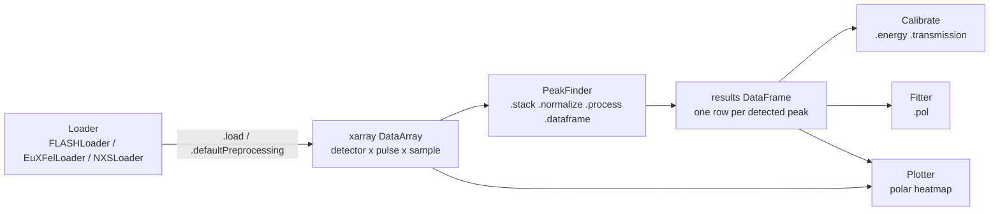

# ToFPipeline

`ToFPipeline.py` is a single-module pipeline for loading, preprocessing, peak-finding,
energy-calibrating and visualizing time-of-flight (ToF) electron-spectrometer data
recorded with a multi-detector "velocity map"/angular array (e.g. at FLASH, European
XFEL, or from offline `.nxs` histogram files). It is built around `xarray`/`dask` so
that traces from many detectors, trains and pulses can be processed lazily and in
parallel, and around a small `pandas`-based "results" table used for calibration and
polarization fitting.

## Contents

- [Overview](#overview)
- [Requirements](#requirements)
- [Data model](#data-model)
- [Configuration (`GlobalConfig` / `config.yaml`)](#configuration-globalconfig--configyaml)
- [Loaders](#loaders)
- [`PeakFinder`](#peakfinder)
- [`PhotonEnergyProcessor`](#photonenergyprocessor)
- [`Calibrate`](#calibrate)
- [`Fitter`](#fitter)
- [`Plotter`](#plotter)
- [Low-level peak-finding functions](#low-level-peak-finding-functions)
- [Typical workflow](#typical-workflow)

## Overview

The pipeline is organized as a chain of composable, chainable-method objects:



Every class inherits from `Configurable`, which pulls its default parameters from a
class-scoped section of a global YAML config (loaded once via `GlobalConfig.load`).
Any parameter can still be overridden per-call or per-instance.

## Requirements

Core dependencies: `numpy`, `pandas`, `xarray`, `dask`, `h5py`, `scipy`, `matplotlib`,
`pyyaml`, `tqdm`.

Facility-specific loaders import optional, environment-specific packages lazily
(only when that loader is actually instantiated):
- `FLASHLoader` → `fab.magic` (`beamtime`, `ballchamber`, `opis`, `example.GMD`)
- `EuXFelLoader` → `extra_data`, `euxfel_bunch_pattern`, `extra.components`
- `NXSLoader` has no extra dependency beyond `h5py` and reads `.nxs` files directly.

## Data model

All loaders produce an `xarray.DataArray` with the same convention:

| Dimension  | Meaning                                                              |
|------------|-----------------------------------------------------------------------|
| `detector` | Channel/ToF-detector index (angle mapping provided separately)        |
| `pulse`    | MultiIndex of `(trainId, pulseId)`                                     |
| `sample`   | Time-of-flight bin / ADC sample index                                  |

A `daq_run` coordinate (aligned with `pulse`) tracks which run/file each pulse came
from, which lets later steps group/slice per run.

Peak-finding results are collapsed into a flat `pandas.DataFrame` with one row per
detected peak, with (at minimum) the columns:

```
detector, trainId, pulseId, peakNo, pos, height, width left, width right,
fwhm area, baseline left, baseline right, noise amplitude
```

Downstream steps (`Calibrate`, `Fitter`, `Plotter`) merge in extra columns such as
`Photon Energy` and `Angles`.

## Configuration (`GlobalConfig` / `config.yaml`)

```python
from ToFPipeline import GlobalConfig
GlobalConfig.load("config.yaml")
```

`config.yaml` has one top-level section per class name (e.g. `FLASHLoader`,
`PeakFinder`, `Calibrate`, ...). `Configurable.__init__` looks up
`GlobalConfig.get_for_class(self.CONFIG_KEY or type(self).__name__)` and stores it as
`self.config`, optionally overridden by a `config=` dict passed to the constructor.
Every method reads its defaults with `self.config.get("key", default)`, so any
parameter in `config.yaml` can be omitted from a call to fall back to the file, or
passed explicitly to override it for a single call.

Key sections used in [config.yaml](config.yaml):

| Section                | Purpose                                                                 |
|-------------------------|--------------------------------------------------------------------------|
| `FLASHLoader`           | `ToF` detector list, `angles`, train/pulse slicing, `sampleShift`, `baselineRegion` |
| `DoocspieStream`        | Live-stream detector addresses/angles/shifts (see `addresses.py`)        |
| `PeakFinder`            | `threshold`, `peakNo`, stacking, smoothing, symmetric/width options       |
| `PhotonEnergyProcessor` | Photon-energy scan range/step, `singleRun` mode                          |
| `Calibrate`             | `peakNo`, `beta` used for the transmission calibration                   |

`NXSLoader` and `Plotter` read their `ToF`/`angles` from the `NXSLoader` config
section (`Plotter.CONFIG_KEY = "NXSLoader"`).

## Loaders

All loaders subclass `Loader(Configurable)`, which provides two shared trace-shifting
utilities used during preprocessing:

- **`sampleShift(shift=None, mode=None)`** — shifts every detector's trace along the
  `sample` axis by a scalar or a `{detector: shift}` dict, either zero-padding
  (`mode="zero"`) or circularly wrapping (`mode="roll"`) the vacated samples. Used to
  align detectors whose electronics/cables introduce a fixed time offset.
- **`pulseShift(shift=None, mode=None)`** — same operation, but shifting per pulse
  (`{pulseId: shift}`) instead of per detector.

Concrete loaders implement `.load(...)` (raw data ingestion) and
`.defaultPreprocessing(...)` (baseline subtraction, detector/train selection, and
alignment), and return `self` so calls can be chained, e.g.:

```python
data = FLASHLoader(proposal, runNo).load().defaultPreprocessing().data
```

### `FLASHLoader`

Loads ToF traces and auxiliary channels for a FLASH beamtime run via the internal
`fab.magic` API (`ballchamber` for ADC traces, `opis` for photon energy, `example.GMD`
for pulse energy).

- `load(key="all", trainStart=None, trainStop=None, trainStep=None, pulseStart=None, pulseStop=None, pulseStep=None, roi=[None, None])`
  — reads the raw run, stacks `train_id`/`shot_id` into a `pulse` MultiIndex, combines
  the 16 `adcXX` variables into a `detector` dimension, and (depending on `key`) also
  loads interpolated **Photon Energy** (from OPIS) and/or **GMD** pulse-energy data.
- `defaultPreprocessing(ToF=None, baselineRegion=None, trainStart=None, trainStop=None)`
  — selects the configured `ToF` detectors, subtracts+inverts the mean baseline
  region, and slices pulses per `daq_run`.

### `EuXFelLoader`

Loads raw digitizer traces for a European XFEL run via `extra_data`, with run objects
cached process-wide in `_RUN_CACHE` keyed by `(proposal, runNo)` to avoid re-opening
the same run.

- `run` (property) — lazily opens (and caches) the `extra_data` run.
- `load(key="all", trainStart=0, trainStop=-1, trainStep=1)` — slices trains and
  optionally loads the **XGM** intensity and/or **Photon Energy** color-2 channel.
- `filterByIntensity(intensityThreshold=None)` — drops trains below an XGM intensity
  threshold.
- `detectors(proposal, run)` — looks up the per-run detector configuration file
  (`configurations/<proposal>/<from>-<to>.txt`) describing channel/digitizer/angle
  mapping.
- `offsets(proposal, run)` — looks up per-run `train_offset`/`pulse_length` from
  `configurations/<proposal>/offsets.cfg`.
- `defaultPreprocessing(ToF=None, pattern_noise_region=None, pattern_noise_sym=None)`
  — extracts per-pulse traces for the configured detectors via `AdqRawChannel`
  (with common-mode/pattern-noise correction), inverts the signal, and applies
  `sampleShift()`.

### `NXSLoader`

Loader for offline `.nxs` (NeXus/HDF5) histogram files, where each file is one run
containing per-channel histograms (`scan/instrument/histogram_chNN/data` and
`.../time_of_flight`).

- `load(runNumbers=None, roi=None)` — auto-detects run numbers from files in
  `dataPath` if none are given, reads each file's 15 channels (missing channels are
  zero-filled), concatenates runs along `pulse`, and builds an `xarray.DataArray`
  with `detector`/`pulse`/`sample` dimensions and a `daq_run` coordinate. `roi`
  restricts the sample axis while preserving original sample indices.
- `defaultPreprocessing(ToF=None, baselineRegion=None, trainStart=None, trainStop=None)`
  — selects detectors, subtracts the mean baseline region, optionally slices pulses
  per run, and applies `sampleShift()`.
- Internal helpers: `_getFilePath`, `_extractRunNumber`, `_loadSingleFile`.

## `PeakFinder`

`PeakFinder(data, config=None)` operates on the `xarray.DataArray` produced by a
loader (`self.data`) and accumulates peak-finding results (`self.results`). Most
methods mutate `self.data`/`self.results` and return `self` for chaining.

Filtering / conditioning:
- `filterByIntensity(pulseEnergy, lowerThreshold=None, upperThreshold=None)` — keeps
  only pulses whose external pulse-energy measurement falls within thresholds.
- `filterByHeight(lowerThreshold=None, upperThreshold=None)` — NaNs out
  `(detector, pulse)` combinations whose peak trace maximum is outside thresholds.
- `normalize(ToF=None)` — divides the whole array by its global max, or by the max
  of a reference detector.
- `smooth(windowSize=None)` — centered rolling-mean smoothing along `sample`.
- `tShift(shift=None)` — zero-padded shift along `sample`, per detector or global.
- `subtractPeriodicNoise(noiseRegion=None)` — estimates a periodic noise pattern from
  a reference window and tiles/subtracts it across the full trace.
- `fftNoiseSubtraction(minFreq=None, maxFreq=None, sampleSlice=None)` — band-stop
  filters a frequency range (in cycles/sample) via FFT to remove periodic pickup
  noise.

Stacking:
- `stack(stackTrains=None, trainStackSize=None, stackPulses=None, pulseStackStart=None, pulseStackStop=None, pulseStackSize=None, pulseStackStep=None)`
  — averages traces over groups of trains and/or groups of pulses to improve SNR,
  rebuilding a consistent `pulse` MultiIndex afterwards.

Peak detection:
- `process(threshold=None, peakNo=None, roi=None, distanceFactor=None, widthFraction=None, symmetric=None, minWidth=True, slopeLength=None, maxSlope=None, slopeStartHeight=None, noiseRegion=None)`
  — computes a per-detector noise floor from `noiseRegion`, then runs
  `findPeaksInTrace_np` per `(detector, pulse)` trace via `xr.apply_ufunc` (vectorized,
  dask-parallelized) to find up to `peakNo+1` peaks with position/height/FWHM
  widths/area/baseline. Results are stored in `self.results` and automatically
  converted to a DataFrame.
- `dataframe()` — flattens the raw per-pulse peak-list `DataArray` into the tabular
  `self.results` DataFrame described in [Data model](#data-model).
- `fitGaussians(useUpperHalf=True, roiWidthMultiplier=None, roiAbsolute=None, multiGauss=None, baseline=None)`
  — fits one or more Gaussians to each detected peak (optionally restricted to the
  upper half above FWHM, with an optional linear baseline subtraction), adding
  `gauss[_n]_amplitude/center/sigma/area/fwhm_area` columns to `self.results`.

Plotting (see also [`Plotter`](#plotter) for the polar view):
- `plot(...)` — grid of per-detector trace plots (one train/pulse) with peak
  markers, FWHM lines, baseline overlay, optional Gaussian fit curves, and optional
  secondary energy or time (ns) axis via `energyCalib`/`sampleRate`.
- `plotSingle(...)` — same as `plot`, but for a single detector in its own figure
  with a legend.

## `Calibrate`

`Calibrate(results, config=None)` turns a peak-finding results table (typically from
a `PhotonEnergyProcessor` scan) into per-detector calibration curves.

- `madFilter(x, y, thresh=3)` — median-absolute-deviation outlier mask, used to
  reject bad fit points before curve fitting.
- `energy(relPos=False, peakNo=None, guess=None, bindingEnergy=0)` — fits
  `energyCalibFunc` (`p0 + p1/√(e+p2) + p3/(e+p4)^1.5`) per detector, mapping peak
  sample position → photon (or kinetic, via `bindingEnergy`) energy. Produces
  `self.energyParam` with fit parameters, errors, and the valid position range
  (`pos_min`/`pos_max`) per detector. Initial guesses/bounds are computed
  automatically from the data if `guess` is not supplied.
- `transmission(peakNo=None, setBeta=None, setPhi=None, setPlin=None, intMethod="height")`
  — computes a per-detector, per-energy **Transmission Coefficient** by comparing
  the measured peak intensity to the ideal `polarization_model` intensity at each
  detector's angle. This coefficient is later used by `Fitter.pol` and `Plotter` to
  correct for detector-to-detector efficiency/solid-angle differences.
- `plotTransmission(...)` / `plotEnergy(...)` — diagnostic plots of the fitted
  transmission coefficients and the energy-calibration curves per detector.

## `Fitter`

`Fitter(results, config=None)` fits the angular distribution of peak intensities
across detectors to extract polarization parameters.

- `pol(transParam=None, peakNo=None, beta=0, setPlin=None, setPhi=None, fitBeta=False, intMethod="height", groupParam=True, plot=True, orientation="N", direction=1, plotError=False, weightByNoise=False, rOff=0.1, angOff=0, shiftAngOff=0, legendPos=None)`
  — calibrates each detector's intensity using the closest-matching
  `Transmission Coefficient` (from `Calibrate.transmission`, matched by nearest peak
  position and photon energy), then fits `polarization_model`/`sepModel` to the
  angular intensity distribution via `scipy.optimize.curve_fit`. Depending on which
  of `setPlin`/`setPhi` are fixed, it fits the remaining subset of
  `{Plin, phi, beta2, scale}` (optionally weighting by noise amplitude), and can
  render a polar plot of the data with the fitted curve and parameter table.
  Returns `(fit_params, errors)`.

Module-level physics models used throughout `Calibrate`/`Fitter`/`Plotter`:

- `polarization_model(theta, Plin=1, phi=0, beta2=2, scale=1)` — dipole angular
  distribution: `scale * (1 + (beta2/4) * (1 + 3*Plin*cos(2*(theta-phi))))`.
- `sepModel(theta, A, B, beta2=2, scale=1)` — same model reparametrized with
  `A = Plin*cos(2*phi)`, `B = Plin*sin(2*phi)` for a better-conditioned fit when
  `phi` is free.

## `Plotter`

`Plotter(data, results=None, config=None)` (`CONFIG_KEY = "NXSLoader"`) renders a
single train/pulse's multi-detector traces as a polar heatmap (angle = detector
position, radius = sample/time, color = intensity).

- `plot(trainId=None, pulseIndex=0, pulseId=None, sampleMin=None, sampleMax=None, vMin=None, vMax=None, figsize=(8,8), interpolate=True, nTheta=720, transParam=None, showModel=False, Plin=1.0, phi=0.0, beta2=2.0, scale=1.0, modelRadius=None, modelColor="red", modelLabel=None, cbarLabel="Intensity", title=None, ax=None, direction=1, orientation="E", sampleRate=None, t0=0)`
  — selects one train/pulse slice, optionally applies a transmission calibration
  (`transParam`), either interpolates smoothly between detector angles
  (`interpolate=True`) or draws discrete angular wedges, and overlays detected peak
  positions/widths from `results` if provided. The radial axis can be shown in raw
  sample indices or converted to nanoseconds via `sampleRate`/`t0`. Saves the figure
  to `polHeat.png`.

## Low-level peak-finding functions

These free functions implement the actual single-trace peak search used by
`PeakFinder.process` (the `_np` variants are the current, vectorized implementation;
the non-`_np` versions are an earlier, unvectorized equivalent kept for reference):

- `findPeakBaseline(trace, peak, slopeLength=5, maxSlope=4, startOffsetL=0, startOffsetR=0)`
  — walks outward from the peak (or from a given start offset) until the local
  slope falls below `maxSlope`, returning the two baseline endpoint indices used for
  linear baseline subtraction.
- `findPeak_np(trace, widthFactor=2, symmetric=False, maxWidth=20, minWidth=False, widthFraction=0.5, slopeLength=False, maxSlope=False, originalTrace=None, slopeStartHeight=None)`
  — finds the largest remaining peak, its FWHM width (symmetric or asymmetric),
  area, and baseline; zeroes the peak region in the working trace so the next call
  finds the next-largest peak.
- `findPeaksInTrace_np(trace, peakNo, cutOff=2, noiseAmp=[0,1], widthFactor=2, widthFraction=0.5, symmetric=True, maxWidth=30, minWidth=False, slopeLength=5, maxSlope=4, slopeStartHeight=None)`
  — repeatedly calls `findPeak_np` to find `peakNo+1` peaks above a noise-relative
  `cutOff` threshold, returning `None` if fewer than the requested number of peaks
  are found (so downstream code can skip/ignore ambiguous pulses).
- `findSymmetricPeakWidth` / `findAsymmetricPeakWidth` / `findPeak` /
  `findPeaksInTrace` — earlier, pure-Python versions of the same logic.
- `energyCalibFunc(e, p0, p1, p2, p3, p4)` — the sample-position ↔ energy conversion
  function used by `Calibrate.energy` and for plotting secondary energy axes.

## Typical workflow

```python
from ToFPipeline import GlobalConfig, NXSLoader, PeakFinder, Calibrate, Fitter, Plotter

GlobalConfig.load("config.yaml")

# 1. Load and preprocess raw traces for one or more runs
loader = NXSLoader(dataPath="data", runNumbers=[2000])
data = loader.load().defaultPreprocessing().data

# 2. Find peaks per (detector, pulse) trace
pf = PeakFinder(data).stack().normalize().process()
results = pf.dataframe().results

# 3. (Photon-energy scans) build energy/transmission calibration
# cal = Calibrate(scanResults).energy().transmission()

# 4. Fit the angular (polarization) distribution
fitter = Fitter(results)
params, errors = fitter.pol(peakNo=0)

# 5. Visualize a single pulse as a polar heatmap
Plotter(data, results=results).plot()
```

See [HowTo.ipynb](../HowTo.ipynb) and [offlineAnalysis.ipynb](../offlineAnalysis.ipynb)
for end-to-end interactive examples using this module.
